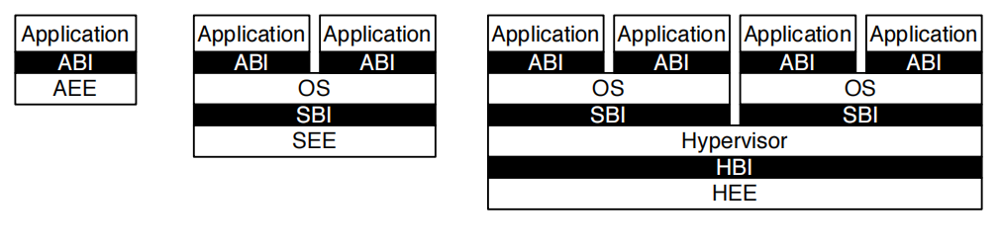

# RV32/64 特权架构

## 1.   为什么要有特权等级
特权等级的存在是为了解决在硬件上运行不受信代码的安全问题。通俗来讲就是为了让系统不容易崩溃。
代码不可信的原因主要有两种：

1.  恶意代码企图完全夺取系统的控制器
2.  软件代码过于庞大无法完全防止错误的产生

换句话说，如果能够保证系统上跑的所有代码都是可信的，那么硬件就没必要实现特权架构。
反之，如果系统不可避免要运行不可信代码，那么特权等级就是必要的。

## 2.   软件栈的层级结构
为了将不同授信等级的软件隔离开，软件栈出现了层级结构。软件栈的低层比高层有着更高的授信等级，同时为高层软件提供了执行环境。
下图展示了三种层数不同的软件栈结构 

最左边的图为嵌入式系统的软件栈，所有的应用程序都运行在机器模式下，裸板就是应用程序的运行环境。

中间的图为带操作系统的软件栈结构。OS 为应用程序提供了运行环境，机器为 OS 提供了运行环境。OS 的代码是完全受信的。应用程序的代码是非授信的。

最右边的图为虚拟机软件栈结构。机器为 Hypervisor 提供执行环境， Hypervisor 为操作系统提供虚拟机运行环境，然后 OS 为应用程序提供了运行环境。

## 3. RISC-V 的三种模式
RISC-V 特权架构现在定义了三种不同等级的特权模式，按等级由高到底排列为：

机器模式(Machine Mode) > 监管者模式(Supervisor Mode) > 用户模式(User Mode)

实现一种或多种模式的硬件平台上可以搭建不同的系统：
+ 只实现机器模式：简单嵌入式系统
+ 实现机器模式+用户模式：安全嵌入式系统
+ 实现机器模式+监管者模式+用户模式：类 Unix 操作系统
三种模式中，机器模式是硬件平台必须支持的。

下面把三种模式分别简称为 M、S、U 模式，高特权等级的模式可以使用低特权等级模式的所有功能。
下面我们从低到高来说明各个模式可用的功能。

### U 模式的特性

用户模式的权限包括：
* 指令使用：可以使用 ISA 中的通用指令，包括
    +   整数计算
    +   控制转移
    +   内存访存
    +   内存同步
    +   环境调用
    +   操作用户级 CSRs 的 CSR 指令
* 内存访问：可访问的地址由 S 模式（如果有的话）和 M 模式控制
* trap：用户级 trap 的处理与返回（URET指令）。

U 模式与更高等级的模式相比，受到的限制主要在对某些 CSRs 的操作以及对内存的访问限制。
由于 RISC-V 对 IO 设备的访问是通过内存映射的方式，所以 U 模式对 IO 的操作也受限。
U 模式下，要想访问这些受限资源，必须通过中断或异常的方式陷入更高等级模式。

### S 模式的特性

监管者模式主要用于运行操作系统（如类 Unix 系统）或者操作系统内核（微内核系统）。
S 模式最核心的功能是支持基于页面的虚拟内存。相比于 U 模式， S 模式增加的权限包括
* 指令使用：
    + 添加了一条 sfence.vma 指令，用于刷性 TLB 缓存
    + 操作 S 模式的 CSRs(如 satp, Supervisor Address Translation and Protection) 的 CSR 指令
* 内存访问：可访问被 PMP 物理内存保护系统允许的内存区间
* trap：S 模式级 trap 以及被 M 模式委托的 trap 的处理与返回（SRET指令）

### M 模式的特性

机器模式可以自由地访问硬件平台，负责处理中断、异常，以及执行 IO。
M 模式对内存，I/O 和一些对于启动和配置系统来说必要的底层功能有着完全的使用权。因此它是唯一所有标准 RISC-V 处理器都
必须实现的权限模式。实际上简单的 RISC-V 微控制器仅支持 M 模式。

机器模式最重要的特性是拦截和处理 trap（不寻常的运行时事件）的能力。RISC-V 将
异常分为两类。一类是同步异常，这类异常在指令执行期间产生，如访问了无效的存储器
地址或执行了具有无效操作码的指令时。另一类是中断，它是与指令流异步的外部事件，
比如鼠标的单击。机器模式的 trap 可以被委托给 S 模式进行处理。

## 4.   PMP 与基于页面的虚拟内存

## 5.   trap 的处理过程

